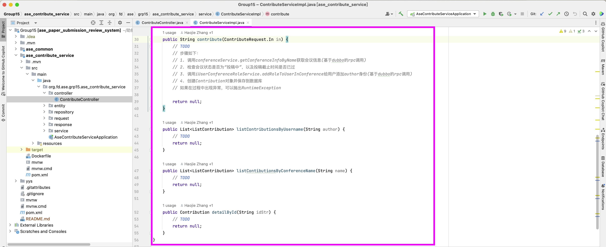

# 云原生软件技术 Lab1 小粒度模块开发与容器技术
> 张皓捷 胡明明 杨特 王浩睿

本次Lab中，我们将对一个简单的微服务系统中的一个小粒度模块进行开发。我们将实践Docker工具的使用，并将开发好的模块打包成Docker镜像，并推送到Docker Hub上。最后，我们将实践Docker Compose工具的使用，将我们开发好的模块与其他模块组合成一个完整的微服务系统运行起来。

## 背景介绍

### 系统介绍

本次实验使用的系统是一个简单的投稿审稿系统。

系统中一共有四类角色，分别是会议主席(chair)，审稿人(pc member)，作者(author)，管理员(admin)。

系统中的用户包括普通用户(user)和管理员(admin)，他们从同样的入口登录，然后根据角色使用不同的功能。普通用户需要用邮箱注册获得登录账号，管理员使用预设的账号登录。普通用户包括chair，PC member和author。

chair是申请开设并管理审稿过程的人，pc member是chair邀请来参加会议的人，author是向会议提交论文的人。用户在不同的会议中可以担任不同的角色，例如张三可以在会议A中是chair，会议B中是pc member，会议C中是author。

**系统具有以下功能**：

1. 用户可以在系统中注册账号并登录
2. 用户可以申请开设会议，管理员审批通过后会议自动进入准备阶段，申请人自动成为会议的chair
3. 会议的chair可以向其他用户发送邀请，邀请他们成为会议的pc member。被邀请人可以接受或拒绝邀请。接受邀请后，被邀请人成为会议的pc member  
4. 用户可以看到目前开设的所有会议，可以查看会议的基本信息，例如会议的名称，简介，时间，地点等。如果该会议处于“投稿中”状态，用户可以向该会议投稿。投稿时，用户需要填写论文的基本信息，例如论文的标题，摘要，关键词，并提供论文的PDF文件。投稿成功后，用户成为该论文的author

### 系统技术概述

目前系统中包含了以下几个服务：

- 用户服务：负责用户的注册，登录，角色管理等功能
- 会议服务：负责会议的创建，审批等功能
- 通知服务：负责PC member的邀请
- 文件服务：负责存储与分发用户上传的文件(PDF)
- **投稿服务：负责用户的投稿(需要同学们开发)**
  

**系统内置了一个管理员账号，用户名为`admin`，密码为`adm123456`。**

本次Lab中的系统的所有服务均使用了以下技术：

- Java 17
- Spring Boot 3
- MySQL 8
- Nacos 作为服务注册中心
- Redis 用来存储用户的登录状态，以在多个服务之间共享用户的登录状态

本次Lab中，同学们首先需要拉取已经开发好的几个服务的Docker镜像并在本地运行，以体验系统的功能。然后，同学们需要开发投稿服务，并使用Docker打包成镜像，并推送到Docker Hub上。最后，使用Docker Compose组合整个系统。 

## 环境准备

本节中，我们将安装Docker并启动系统中除投稿服务外的所有服务。在此过程中，我们将学习Docker的基本使用方法，包括拉取镜像，查看镜像，运行容器，查看容器的运行状态，查看容器的日志，登录容器等。

### 安装Docker

首先，需要安装Docker。Docker是一个开源的应用容器引擎，让开发者可以打包他们的应用以及依赖包到一个可移植的容器中，然后发布到任何流行机器上。Docker的安装非常简单，可以参考以下资源：

Windows：[Docker Desktop 官方文档](https://docs.docker.com/desktop/install/windows-install)

macOS：[Docker Desktop 官方文档](https://docs.docker.com/desktop/install/mac-install/) 或者使用 [OrbStack](https://orbstack.dev/)

Linux：[Docker Engine 官方文档](https://docs.docker.com/engine/install)

安装完成后，可以拉取hello-world镜像并运行，以验证Docker是否安装成功：

```bash
docker pull hello-world # 从Docker Hub拉取hello-world镜像
docker images # 查看本地镜像，可以看到刚刚拉取的hello-world镜像
docker run hello-world # 运行hello-world镜像，如果镜像不存在，会自动从Docker Hub拉取
```

如果看到以下输出，说明Docker的安装和配置没有问题：

```bash
huajuan@huajuan-ws:~$ docker run hello-world # 使用docker run命令运行hello-world镜像
Hello from Docker!
This message shows that your installation appears to be working correctly.

......(省略)......
```

### 启动中间件

投稿审稿系统依赖了一些中间件，包括MySQL，Nacos和Redis。可以使用以下脚本一键启动这些中间件：

```bash
./yys/lab1/middlewares/run_middlewares.bash
```

以Docker Desktop为例，如果可以看到中间件的容器运行起来（如下图），说明中间件启动成功：


打开`run_middlewares.bash`脚本，可以看到这些中间件的启动利用了Docker Compose工具。后续我们将实践这些工具。在这里可以感受一下使用Docker和Docker Compose部署的便利性。

```bash
# 启动mysql-docker
cd mysql-docker || exit
# 执行docker-compose up -d并判断是否成功
if docker compose up -d; then
  echo "mysql-docker启动成功"
else
  echo "mysql-docker启动失败"
  exit 1
fi
```

如果需要停止中间件，可以使用以下脚本：

```bash
./yys/lab1/middlewares/stop_middlewares.bash
```

### 启动系统(除投稿服务外)

使用以下脚本启动系统(除投稿服务外)：

```bash
./yys/lab1/run_services.bash
```

和之前启动hello-world镜像一样，`run_services.bash`脚本使用`docker run`命令启动了系统中的所有服务。如果你的中间件没有部署在本地而是在远程服务器上，你需要修改`NACOS_HOST`，`MYSQL_HOST`和`REDIS_HOST`这三个环境变量的值为对应的IP地址。

```bash
# 创建网络
docker network create ase-network

# 运行ase-conference-service
docker run -d --network ase-network --name ase-conference-service -e env=prod -e NACOS_HOST=host.docker.internal -e NACOS_PORT=8848 -e MYSQL_HOST=host.docker.internal -e MYSQL_PORT=13306 -e REDIS_HOST=host.docker.internal -e REDIS_PORT=6379 huajuan6848/ase_conference_service:yys-lab1

...(省略)...
```

#### 查看容器运行状态

以Docker Desktop为例，如果可以看到系统的服务容器运行起来（如下图），说明系统启动成功：


除了在Docker Desktop的GUI界面中查看容器的运行状态外，还可以使用`docker ps`命令查看容器的运行状态。`docker ps`命令不会列出已经停止的容器，只会列出正在运行的容器。如果需要查看所有的容器，可以使用`docker ps -a`命令。


#### 查看容器的日志

可以使用`docker logs`命令查看容器的日志。例如，`docker logs ase-conference-service`命令可以查看`ase-conference-service`容器的日志。


#### 登录容器

可以使用`docker exec`命令登录容器。例如，`docker exec -it ase-conference-service /bin/bash`命令可以登录`ase-conference-service`容器，并在容器中打开一个bash shell。可以在打开的bash shell中在容器中执行命令。


#### 停止/删除容器

如果需要停止容器，可以使用`docker stop`命令。例如，`docker stop ase-conference-service`命令可以停止`ase-conference-service`容器。如果需要删除容器，可以使用`docker rm`命令，使用方法和`docker stop`命令类似。

`docker stop`和`docker rm`命令的参数可以是容器的名称，也可以是容器的ID。容器的ID可以使用`docker ps`命令查看。

如果需要停止系统，可以使用以下脚本：

```bash
./yys/lab1/stop_services.bash
```

### 体验系统

打开浏览器，访问[127.0.0.1](127.0.0.1)，可以看到系统的登录页面。可以注册账户后进行登录，申请会议，邀请PC member等操作。**管理员账号的用户名是`admin`，密码是`adm123456`。**


当然，因为投稿服务还没有开发，所以在投稿页面会看到“投稿服务-调用失败”的提示。


## 任务一：开发系统中的一个小粒度模块(服务)

> 在任务一中，同学们需要开发系统中的一个小粒度模块(服务)，即投稿服务。投稿服务需要调用会议服务与用户服务，以完成其功能。

使用IntelliJ IDEA打开项目根目录(yys_lab1)。进入`ase_contribute_service`下的`ContributeController`和`ContributeServiceImpl`。**根据函数定义和注释，实现四个函数以完成投稿服务的功能。**



在实现`contribute`函数的过程中，需要调用会议服务以查找会议的信息和状态，还需要调用用户服务以向用户添加author角色。和单体应用直接在本地调用不同，由于微服务系统中各个服务是相互独立的，因此这里使用了[dubbo](https://cn.dubbo.apache.org/zh-cn/)进行服务间的调用。其工作原理如下：服务消费者（Consumer）通过服务注册中心（下面的图里是zookeeper，我们使用的是Nacos）订阅服务提供者（Provider）的地址，然后通过负载均衡算法选择一个Provider进行调用。


由于本次Lab的重点是Docker和Docker Compose，因此这里助教已经做好了dubbo的相关配置。同学们只需要调用`conferenceService`和`iUserConferenceRoleService`的相关方法即可。dubbo除了提供了服务间通讯的功能，还提供了流量控制，服务降级等服务治理功能，有兴趣的同学可以通过[官方文档](https://cn.dubbo.apache.org/zh-cn/overview/home/)了解更多。

开发完成后，在IntelliJ IDEA中运行`ContributeServiceApplication`。之后，可以在浏览器中访问[127.0.0.1](127.0.0.1)，此时投稿服务应该就可以调通了。尝试进行投稿，查看投稿等操作，以验证投稿服务的功能。

## 任务二：使用Docker打包投稿服务并推送到Docker Hub

> 在任务二中，同学们需要编写一个Dockerfile，用于构建投稿服务的镜像。然后，使用Docker命令构建镜像，并推送到Docker Hub上。

### 注册Docker Hub账号

首先，需要**注册一个Docker Hub账号**（一组注册一个就可以了）。Docker Hub是一个云服务，可以用来存储和分享Docker镜像。注册地址：[Docker Hub](https://hub.docker.com/)。注册完成之后，在Docker Hub主页点击`Repositories`，然后点击`Create Repository`，创建一个自己的Repository。这个Repository将用来存储我们的投稿服务的镜像。


### 编写Dockerfile

Dockerfile是用于构建Docker镜像的文本文件，其中包含了一系列指令，用于指导Docker引擎在容器中进行自动化构建。通过Dockerfile，您可以定义容器的环境、依赖和操作步骤，以便将您的应用程序或服务打包成一个可移植、自包含的镜像。

下面是一个简单的Dockerfile示例，用于构建一个基于Ubuntu操作系统的镜像，并在其中安装一个简单的Python应用程序：

```Dockerfile
# 使用基础镜像
FROM ubuntu:latest
# 维护者信息
LABEL maintainer="Your Name <your.email@example.com>"
# 设置工作目录
WORKDIR /app
# 将当前目录中的文件复制到镜像的/app目录中
COPY . /app
# 安装Python和pip
RUN apt-get update && \
    apt-get install -y python3 python3-pip
# 安装Python依赖
RUN pip3 install --no-cache-dir -r requirements.txt
# 暴露应用程序运行的端口
EXPOSE 8080
# 定义容器启动时运行的命令
CMD ["python3", "app.py"]
```

在上面的示例中：

- FROM 指定了基础镜像，这里是最新版本的Ubuntu操作系统。
- LABEL 用于提供维护者信息。
- WORKDIR 设置了工作目录为/app。
- COPY 将当前目录中的文件复制到镜像的/app目录中。
- RUN 执行一系列命令，这里用于更新包列表、安装Python和pip、安装Python依赖。
- EXPOSE 指定容器运行时应用程序所监听的端口。
- CMD 定义了容器启动时要运行的命令，这里是运行Python应用程序。

**这里，需要同学们编写一个Dockerfile，用于构建投稿服务的镜像。** Dockerfile的编写可以参考[Dockerfile指令详解](https://yeasy.gitbook.io/docker_practice/image/dockerfile)。

编写Dockerfile的提示：

- 使用`openjdk:17-jdk`作为基础镜像
- 编译投稿服务的方法为：在项目根目录(yys_lab1)下运行`./mvnw clean package -pl ase_contribute_service -am -Dmaven.test.skip=true`。生成的jar文件位于`ase_contribute_service/target`目录下

#### 多阶段构建

在Dockerfile中，可以使用多个FROM指令，以实现多阶段构建。多阶段构建可以将构建过程分为多个阶段，每个阶段都可以使用不同的基础镜像，以实现更加灵活的构建过程。**多阶段构建的一个常见用途是在构建阶段中使用编译器和构建工具，然后在最终镜像中只包含运行时所需的文件。**

在我们的场景中，在构建阶段中，我们需要使用投稿服务的源代码，jdk和maven工具(以mvnw，即maven wrapper的形式出现)，以编译出.jar格式的可执行文件。在最终镜像中，我们只需要.jar文件和jdk，不需要maven工具和源代码。

因此，我们可以使用多阶段构建，将构建阶段和最终镜像分开。构建阶段完成后，我们可以使用`COPY --from`指令将构建阶段的产物复制到最终镜像中。

关于多阶段构建的更多信息，可以参考[Dockerfile 多阶段构建](https://yeasy.gitbook.io/docker_practice/image/multistage-builds)。

编写Dockerfile的提示：

- 构建阶段和最终镜像的基础镜像都使用`openjdk:17-jdk`

### 构建并运行镜像

**编写好Dockerfile后，可以使用`docker build`命令构建镜像。**`docker build`命令会读取Dockerfile，并执行其中的指令，以构建镜像。

在项目根目录(yys_lab1)下运行以下命令，构建投稿服务的镜像：

```bash
docker build -t <your-image-name> -f ase_user_service/Dockerfile .
```

其中，`-t`指定了镜像的名称，`-f`指定了Dockerfile的路径。`.`表示构建时的上下文路径（Dockerfile中的`COPY`等指令都会使用这个路径）。

构建完成后，可以使用`docker images`命令查看构建好的镜像：

使用以下命令运行构建好的镜像。事实上，[此前](#启动系统除投稿服务外)`run_services.bash`脚本就是利用类似的命令运行了系统中的服务。

```bash
docker run -d --network ase-network --name ase-contribute-service -e env=prod -e NACOS_HOST=host.docker.internal -e MYSQL_HOST=host.docker.internal -e REDIS_HOST=host.docker.internal <your-image-name>
```

命令的参数说明：

- `-d`表示以后台模式运行容器(detached mode)
- `--network ase-network`表示将容器连接到名为`ase-network`的网络，这个网络是由`run_services.bash`脚本创建的。关于docker网络的更多信息，可以参考[Docker 网络](https://yeasy.gitbook.io/docker_practice/network)和[这篇文章](https://juejin.cn/post/7041923410649153543)
- `--name ase-contribute-service`表示为容器指定一个名称
- `-e`表示设置容器内的环境变量，这里设置了`env`，`NACOS_HOST`，`MYSQL_HOST`和`REDIS_HOST`四个环境变量，这四个环境变量都被投稿服务使用。`host.docker.internal`是Docker Desktop中的一个特殊域名，用于在容器内访问宿主机的地址

#### 使用docker buildx以构建并推送支持多种架构的镜像

我们使用`docker build`命令构建的镜像是针对当前系统的架构的。比如，如果我们的系统是x86_64架构的，那么构建的镜像也是x86_64架构的。如果我们需要构建一个支持多种架构的镜像，可以使用`docker buildx`命令。

关于docker buildx的使用方法，可以参考[How to Rapidly Build Multi-Architecture Images with Buildx
](https://www.docker.com/blog/how-to-rapidly-build-multi-architecture-images-with-buildx/)

### 将镜像推送到Docker Hub

**构建好镜像后，可以使用`docker push`命令将镜像推送到Docker Hub。**在推送镜像之前，需要先使用`docker login`命令登录到Docker Hub。

回忆一下之前在[注册Docker Hub账号](#注册docker-hub账号)中创建的Repository。在推送镜像之前，需要先将镜像的名称修改为`<your-docker-hub-username>/<your-repository-name>:<tag>`的格式。然后，使用`docker push`命令推送镜像。例如，我的Docker Hub用户名是`huajuan6848`，Repository名称是`ase-contribute-service`，则推送镜像的命令如下：

```bash
docker tag <your-image-name> huajuan/ase-contribute-service:lab1-v1
docker push huajuan/ase-contribute-service:lab1-v1
```

推送完成后，可以在Docker Hub上看到推送的镜像。这样，其他人~~(包括助教检查的时候)~~就可以使用`docker pull`命令拉取这个镜像，并在自己的机器上运行。


## 任务三：使用Docker Compose组合整个系统

> 在任务三中，同学们需要把`run_services.bash`脚本改造成一个`docker-compose.yml`，并添加投稿服务，用于组合整个系统。

在[此前](#启动系统除投稿服务外)和[此前](#构建并运行镜像)中，我们使用`docker run`命令分别启动了系统的所有服务(大约5～6个服务)和投稿服务。这样做的缺点是，每次启动系统时，需要手动运行多条`docker run`命令，而且每条命令都需要指定一些参数，比如`--network`，`--name`，`-e`等。这样做非常繁琐，而且容易出错。而Docker Compose可以解决这个问题。

Docker Compose是一个用于定义和运行多容器Docker应用程序的工具。通过Docker Compose，可以使用YAML文件来配置应用程序的服务，然后使用一个命令就可以创建并启动所有服务。

```yaml
version: '3'
services:
  webserver:
    image: nginx:latest
    ports:
      - "80:80"
    volumes:
      - ./nginx.conf:/etc/nginx/nginx.conf
    depends_on:
      - database
  database:
    image: mysql:latest
    environment:
      MYSQL_ROOT_PASSWORD: example_password
      MYSQL_DATABASE: example_db
      MYSQL_USER: example_user
      MYSQL_PASSWORD: example_password
    volumes:
      - db_data:/var/lib/mysql
volumes:
  db_data:
```
以上是一个简单的Docker Compose文件的示例。只要在`docker-compose.yml`文件所在的目录中运行`docker-compose up`命令，就可以启动`webserver`和`database`两个服务。上述Docker Compose文件的主要组成部分如下：

- 定义了两个服务：`webserver`和`database`
- `webserver`服务使用了`nginx:latest`镜像，映射了宿主机的80端口到容器的80端口，挂载了一个`nginx.conf`文件到容器的`/etc/nginx/nginx.conf`路径
- `database`服务使用了`mysql:latest`镜像，设置了一些环境变量，挂载了一个`db_data`卷到容器的`/var/lib/mysql`路径
- 定义了一个`db_data`卷

`docker-compose.yml`中的选项和`docker run`命令中的参数基本是一一对应的。例如，`environment`对应`-e`，`volumes`对应`-v`，`depends_on`对应`--depends-on`, `ports`对应`-p`，`networks`对应`--network`等。

如果需要停止使用Docker Compose启动的服务，可以使用`docker-compose down`命令。该命令会停止并删除所有容器，但不会删除镜像和卷。这样，下次启动服务时，不需要重新拉取镜像，而且之前的数据也不会丢失。

在这一部分的任务中，**同学们需要把`run_services.bash`脚本改造成一个`docker-compose.yml`，并添加投稿服务**，用于组合整个系统。编写的`docker-compose.yml`文件应该满足以下要求：

- 启动系统的所有服务，包括`run_services.bash`脚本中启动的`ase-conference-service`、`ase-notification-service` `ase-user-service`、`ase-file-service`、`ase-gateway` `ase-frontend`和之前构建的投稿服务的镜像。不需要启动中间件
- 将所有的镜像都连接到名为`ase-network`的桥接(bridge)网络，暴露`ase-fronted`的80端口到宿主机的80端口。关于Docker网络的更多信息，可以参考[Docker 网络](https://yeasy.gitbook.io/docker_practice/network)和[这篇文章](https://juejin.cn/post/7041923410649153543)
- 将`ase-file-service`的`/root/upload`目录挂载到宿主机的某个目录，这样用户上传的文件(论文的PDF)就可以保存在宿主机上，而不是容器内。这样做的好处是，即使删除容器后重新创建，用户上传的文件也不会丢失。
- 可以使用`docker-compose up`命令启动整个系统，使用`docker-compose down`命令停止整个系统

关于Docker Compose的更多信息，可以参考[Docker Compose 官方文档](https://docs.docker.com/compose/)和[Docker Compose 教程](https://yeasy.gitbook.io/docker_practice/compose)

## 评分标准

- 任务一：开发系统中的一个小粒度模块(30%)
- 任务二：使用Docker打包投稿服务并推送到Docker Hub(40%)
- 任务三：使用Docker Compose组合整个系统(30%)

## 提交要求

提交要求如下：

**源代码**：在`ase_contribute_service`下编写代码。投稿服务的Dockerfile应该位于`ase_contribute_service/Dockerfile`，Docker Compose文件应该位于项目根目录(yys_lab1)下的`docker-compose.yml`。完成后，将整个项目(yys_lab1)打包成压缩文件，命名为`lab1-group-<your-group-id>.zip`。

**实验报告**：实验报告可以包含以下内容：

- 小组成员信息与分工
- **Docker Hub用户名和投稿服务的仓库名**，以便助教在检查时拉取你们的镜像。
- 使用docker compose部署整个项目成功后，docker desktop中的截图或`docker ps`命令输出的截图，展示当前的容器运行状态
- 小组的实验过程记录，包括**任务一、任务二、任务三的完成情况**，遇到的问题和解决方法
- 每个小组成员单独的实验总结
  

将上述内容打包，提交到`elearning`上。

## 截止日期

**2023年3月31日(周日) 23:59:59**